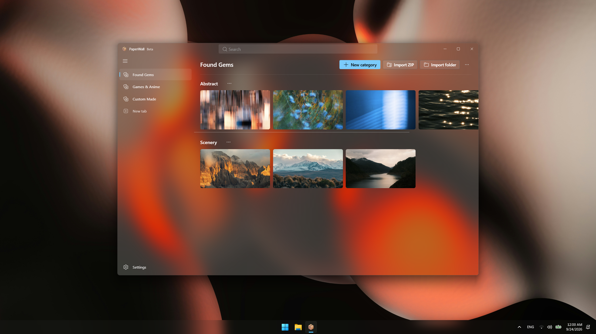
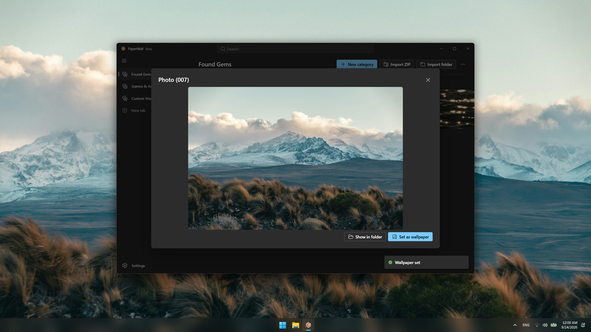
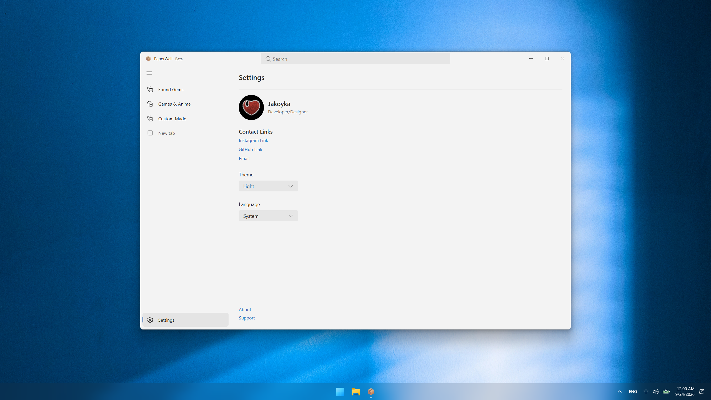

# PaperWall

A wallpaper manager and image collection organizer for Windows 11. Sort your images into tabs and categories, import folders or ZIP files, preview and search them, and set any image as your wallpaper with one click.

Also works as a lightweight gallery for keeping image collections organized: wallpapers, art, screenshots, reference photos.

Built with React + Fluent UI on Tauri 2 (Rust backend, system WebView2, no bundled Chromium).





## Download

Grab the latest installer from the [Releases page](../../releases/latest) and run `PaperWall_<version>_x64-setup.exe`.

> The app is not code-signed, so Windows SmartScreen may show an "Unknown publisher" warning the first time you run it. Click **More info → Run anyway**.

## Features

- **Tabs and categories** to keep your wallpapers organized
- **Import** single images, folders or ZIP files
- **Rescan** folder-based categories to pick up new images
- **Drag to reorder**, including between categories (press and hold, then drag)
- **Preview and set** any wallpaper with one click
- **Search** across every category of every tab (Ctrl+F)
- **Themes**: Dark, Light, and Clear (see-through Acrylic glass, needs Windows 11 22H2 or newer)

## Where your data lives

`%APPDATA%\com.jakoyka.paperwall\`

- `paperwall-state.json`: your tabs, categories, order, theme and language
- `thumbs\`: cached thumbnails (safe to delete, they rebuild)
- `imported\`: images extracted from ZIP files you imported
- `converted\`: PNGs made from formats Windows can't set as a wallpaper directly

To reset the app, close it and delete `paperwall-state.json`.

## Build from source

You need:

- [Node.js](https://nodejs.org) 22.12 or newer
- [Rust](https://rustup.rs) (stable, MSVC toolchain) and the "Desktop development with C++" workload from the [Visual C++ Build Tools](https://visualstudio.microsoft.com/visual-cpp-build-tools/)
- WebView2 (already included in up-to-date Windows 11)

Then:

```
git clone https://github.com/Jakoyka/PaperWall.git
cd PaperWall
npm install
npm run tauri icon src/assets/icon.png
npm run tauri dev
```

The first build compiles all Rust dependencies, which takes 5 to 15 minutes. Later builds are much faster.

To build the installer:

```
npm run tauri build
```

The installer lands in `src-tauri/target/release/bundle/nsis/`. The raw `src-tauri/target/release/paperwall.exe` also runs on its own as a portable app.

## Project layout

- `src/`: React frontend (`config.js`, `styles.css`, `theme.js`, `i18n/translations.js`)
- `src-tauri/src/`: Rust backend (`lib.rs`, `wallpaper.rs`, `library.rs`, `scan.rs`, `state.rs`, `theme.rs`)
- `src-tauri/tauri.conf.json`: app id, product name, version, installer settings

## License

Copyright (C) Jakoyka

PaperWall is free software, released under the [GNU General Public License v3.0](LICENSE). You can use, study, share and modify it, but any version you distribute must stay open source under the same license and keep the original credit.
